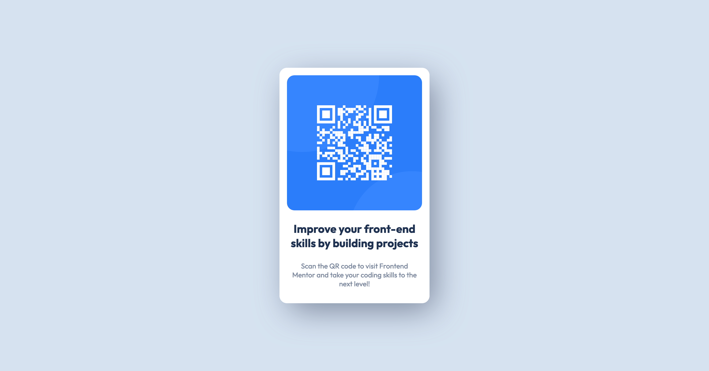

# Frontend Mentor - QR code component solution

This is a solution to the [QR code component challenge on Frontend Mentor](https://www.frontendmentor.io/challenges/qr-code-component-iux_sIO_H). Frontend Mentor challenges help you improve your coding skills by building realistic projects. 

## Table of contents

- [Overview](#overview)
  - [Screenshot](#screenshot)
  - [Links](#links)
- [My process](#my-process)
  - [Built with](#built-with)
  - [What I learned](#what-i-learned)
  - [Useful resources](#useful-resources)
- [Author](#author)

## Overview

### Screenshot

### Links

- Solution URL: [Link to repo](https://github.com/nicholasboyce/qr-code-component-main)

## My process

### Built with

- Semantic HTML5 markup
- CSS custom properties
- Flexbox
- CSS Grid
- Mobile-first workflow

### What I learned

I reviewed flexbox, grid, box shadow, image sizing, and linking to online font sources.

### Useful resources

- [MDN Box shadow ](https://developer.mozilla.org/en-US/docs/Web/CSS/box-shadow) - This helped me remembering box shadow.
- [Sizing images in HTML and CSS](https://www.smashingmagazine.com/2020/03/setting-height-width-images-important-again/) - Don't let the title fool you - this article talks about the importance of giving image sizes in both HTML and CSS, as well as how it impacts accessibility.

## Author

Nicholas Boyce
